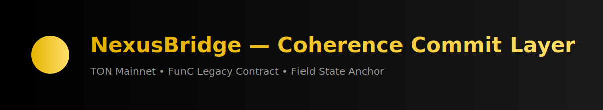

<p align="center">
  
</p>

<p align="center">
  
</p>

<h1 align="center">🌉 NexusBridge — RANNTA Field Sync Node</h1>
<p align="center">Legacy FunC Edition • TON Mainnet • RANNTA Knowledge Hub</p>

<p align="center">
  
  
  
  
  
</p>

---

## 🧩 Overview

**NexusBridge** is the synchronization node that links the **RANNTA token** to its **coherence oracle layer** on the TON blockchain.  
It emits deterministic commit events, maintains minimal state, and enables symbolic-field alignment between on-chain and oracle layers.

Designed for:

- Deterministic FunC execution  
- Minimal gas footprint  
- Lightweight internal messaging  
- Legacy compatibility  
- Full auditability  

---

## 🌐 Network Information

| Field | Value |
|-------|-------|
| **Network** | TON Mainnet |
| **Contract Address** | `EQDCbeNw7iLMUbbnGx17iPL4oOZ0NfdevljzGdYUUgkqhqwj` |
| **Admin** | `UQDKJfVh5jnM0eGlOanDXWl6d8fleIZjoc7SHakWuxS6m4bL` |
| **Linked Token (RANNTA)** | `EQBCY5Yj9G6VAQibTe6hz53j8vBNO234n0fzHUP3lUBBYbeR` |
| **Status** | Experimental / Legacy FunC |

---

## 🎛 Architecture Diagram (ASCII)

        ┌──────────────────────┐
        │    RANNTA Token      │
        │ (Jetton Master State)│
        └──────────┬───────────┘
                   │
                   │ field_state
                   ▼
         ┌──────────────────────┐
         │    NexusBridge       │
         │   (FunC Sync Node)   │
         ├──────────────────────┤
         │ admin           ●    │
         │ oracle          ●    │
         │ commit_counter  ●    │
         └──────────┬───────────┘
                   │ commits
                   ▼
        ┌────────────────────────┐
        │     Oracle Layer       │
        │   (Coherence Node)     │
        └────────────────────────┘

---

## ⚙️ Core Design

### Storage Layout

| Slot | Type | Purpose |
|------|------|---------|
| `admin` | `MsgAddress` | Main control endpoint |
| `field_state` | `MsgAddress` | Linked field node / RANNTA token |
| `oracle` | `MsgAddress` | Coherence oracle endpoint |
| `commit_counter` | `int32` | Tracks processed commits |

---

## 🔑 Opcodes

| Opcode | Function | Parameters | Description |
|--------|----------|-------------|-------------|
| `0xA1` | `set_field_state` | `MsgAddress` | Admin setter |
| `0xA2` | `set_oracle` | `MsgAddress` | Admin setter |
| `0x11` | `external_commit` | `counter:int32`, `source_chain:uint32`, `commitment_hash:slice` | External commit |
| `0x13` | `entanglement_apply` | `target_shard:uint16`, `delta_energy:int64` | Cross-field energy shift |

---

## 📁 Repository Structure

contracts/
├── main.fc # Core FunC contract
├── stdlib.fc # Pinned stdlib version

build/
├── stateInit.cell.ts # Helper: StateInit generator

nexusbridge.manifest.json # Metadata descriptor

---

## 🧪 Message Examples

### External Commit
op: 0x11
counter: 42
source_chain: 1
commitment_hash: <32-byte-slice>

### Set Oracle (admin only)
op: 0xA2
oracle: <MsgAddress>

### Entanglement Apply
op: 0x13
target_shard: 3
delta_energy: -50000

---

## 🔍 Getter Functions

- `get_admin()`
- `get_field_state()`
- `get_oracle()`
- `get_commit_counter()`

All getters are deterministic and indexer-friendly.

---

## 🚀 Build & Deploy

### Build

```bash
toncli build

Deploy
toncli deploy \
  --wc 0 \
  --init build/stateInit.cell \
  --address EQDCbeNw7iLMUbbnGx17iPL4oOZ0NfdevljzGdYUUgkqhqwj \
  --value 0.5

Manifest Auto-Sync Script
node scripts/generate-manifest.js
git add nexusbridge.manifest.json
git commit -m "Auto-sync manifest"

🪶 License
Creative Commons Attribution 4.0 International (CC BY 4.0)
Attribution required: "RANNTA Knowledge Hub — ilia144000"

🧬 RANNTA Ecosystem Context

NexusBridge forms a core component of the RANNTA coherence infrastructure —
bridging symbolic-field computation, oracle alignment, and token-state synchronization across TON.

<h3 align="center">✨ RANNTA — The Field is Alive ✨</h3> <p align="center">© 2025 RANNTA Knowledge Hub</p> ```
